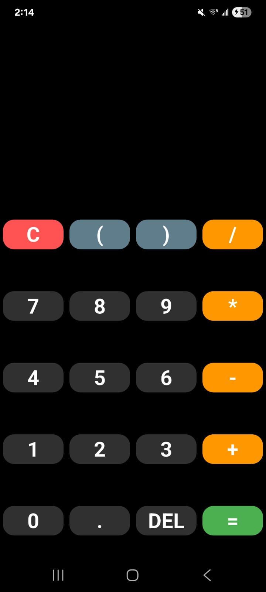
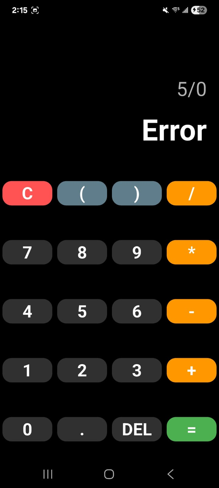
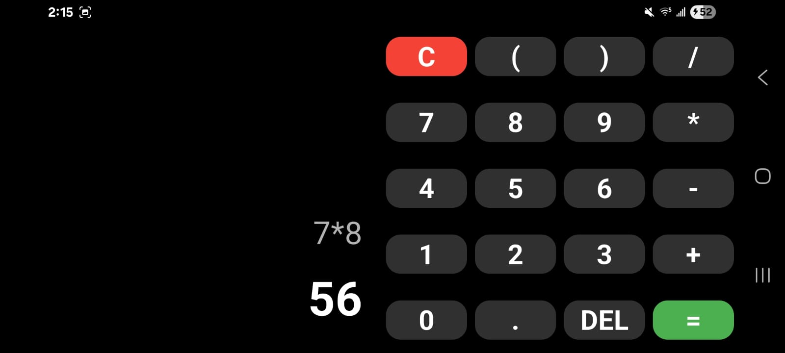

# Calculadora Básica en Flutter

Una aplicación de calculadora, responsiva desarrollada en Flutter. Soporta operaciones aritméticas básicas, uso de paréntesis y validación de expresiones matemáticas.

---

## Características Principales

* **Operaciones Básicas:** Suma, resta, multiplicación y división.
* **Soporte de Paréntesis:** Permite agrupar operaciones `( )`.
* **Multiplicación Implícita:** Detecta y corrige automáticamente expresiones como `(5)(5)` o `5(2)` convirtiéndolas a `5*5` o `5*2`.
* **Diseño Responsivo (OrientationBuilder):**
  * **Vertical (Portrait):** Diseño clásico de calculadora.
  * **Horizontal (Landscape):** Diseño expandido optimizado para mayor espacio.
* **Validación de Errores:** Evita bloqueos por división entre cero o sintaxis inválida.
* **Tema Oscuro:** Interfaz moderna y amigable a la vista.

---

## Dependencias

Este proyecto utiliza el paquete `math_expressions` para el análisis y evaluación precisa de las cadenas de texto matemáticas (Parser).

Se agregaron las siguientes dependencias en el archivo `pubspec.yaml`:

```yaml
dependencies:
  flutter:
    sdk: flutter
  # Librería para evaluar expresiones matemáticas (parsear strings a operaciones)
  math_expressions: ^2.6.0
```

---

## 🚀 Instalación y Ejecución

Sigue estos pasos para probar la aplicación en tu entorno local:

### 1. Clonar o descargar el proyecto

Asegúrate de estar en la carpeta raíz:

```
perezcortes-calculadora-flutter
```

### 2. Instalar dependencias

Ejecuta el siguiente comando en tu terminal:

```bash
flutter pub get
```

### 3. Ejecutar la aplicación

Conecta tu dispositivo o inicia un emulador y ejecuta:

```bash
flutter run
```

---

## Estructura del Código

El archivo principal se encuentra en:

```
lib/main.dart
```

### 🔹 Lógica de entrada

**handleInput**
- Valida que el usuario no ingrese operadores inválidos al inicio
- Evita operadores duplicados consecutivos

### 🔹 Procesamiento matemático

**calculateResult**
1. Limpia la entrada (convierte `x` visual en `*` operativo)
2. Resuelve multiplicaciones implícitas usando Expresiones Regulares (`RegExp`)
3. Utiliza `ShuntingYardParser` de la librería `math_expressions` para procesar el resultado respetando la jerarquía de operaciones

### 🔹 Interfaz de usuario (UI)

- **buildButton** → Botones reutilizables con estilos personalizados
- **verticalLayout / horizontalLayout** → Distribución dinámica según la orientación del dispositivo

## 📸 Capturas de Pantalla

| Modo Vertical | Validación de Error | Modo Horizontal |
|:---:|:---:|:---:|
|  |  |  |

---
